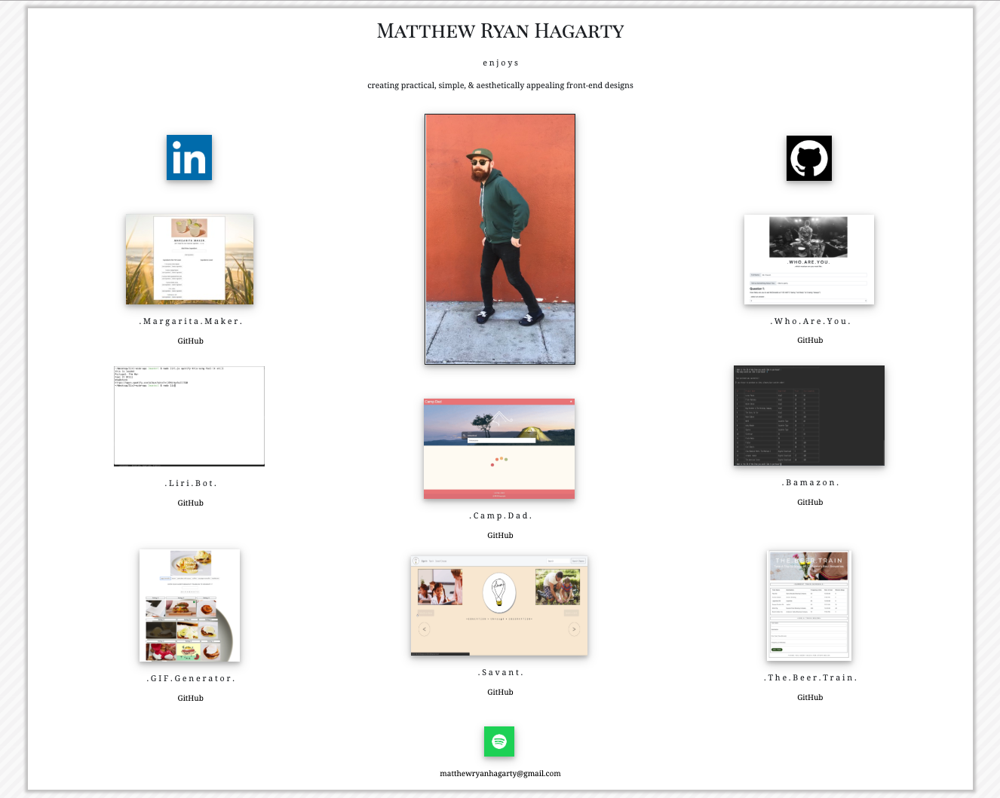

# Portfolio

This is my submission for the updated portfolio assignment. We were tasked with updating our original portfolio page, but this time with no specific parameters other than to include works from our GitHub, our LinkedIn profile, and link to our GitHub repositories. I really enjoyed the opportunity to showcase my current skill sets and particularly enjoyed the process of designing the profile and working to make my vision a reality. Although I encountered a similar problem in making the portfolio responsive, I was able to mostly correct these issues through research and experimentation. In order to accomplish this, I had to utilize my understanding of jQuery, JavaScript, Bootstrap, HTML, & CSS.

Tech I Used:

[HTML](https://www.w3schools.com/html/)

[Bootstrap](https://getbootstrap.com/docs/4.3/getting-started/introduction/)

[CSS](https://www.w3schools.com/css/)

[JavaScript](https://www.w3schools.com/js/)

[jQuery](https://www.w3schools.com/jquery/)

Author: [Matthew Hagarty](https://github.com/matthewryanhagarty)